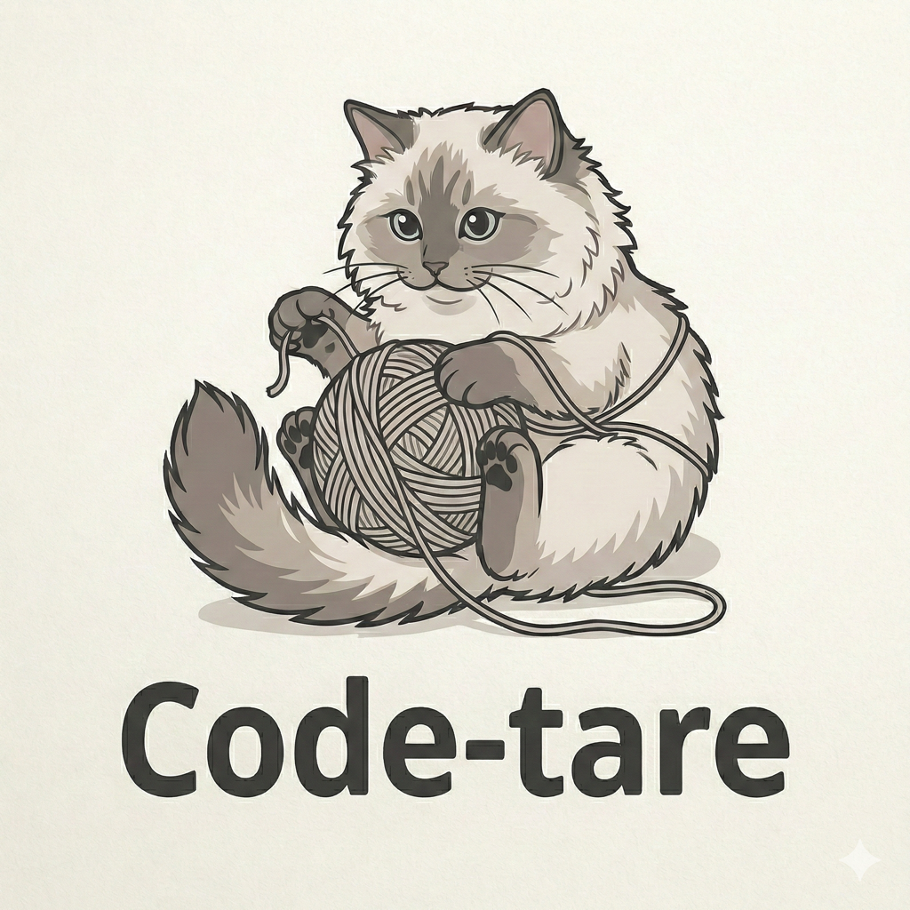

<h1 align="center">Code-tare Native</h1>

<p align="center">
  
</p>

<p align="center">
  <strong>로컬 프로젝트를 한눈에 관리하는 macOS 네이티브 앱</strong>
</p>

<p align="center">
  <a href="https://opensource.org/licenses/MIT"></a>
  <a href="https://github.com/tare/code-tare-native"></a>
  
</p>

## 💡 만들게 된 계기

[웹 버전](https://github.com/tare/code-tare)이 잘 작동했지만, 몇 가지 불편한 점이 있었어요:

- 🔥 **메모리 상시 점유**: 사용하지 않을 때도 ~115MB 차지
- 🖥️ **터미널 관리**: 서버를 수동으로 켜고 꺼야 함
- 🌐 **브라우저 필요**: 별도로 브라우저를 열어야 사용 가능

"더블클릭 한 번으로 바로 실행되면 좋겠다냥!" 🐱

그래서 Tauri를 사용해 **macOS 네이티브 앱**으로 만들었습니다!

## ✨ 웹 버전 vs 네이티브 앱

| 항목 | 웹 버전 | 네이티브 앱 |
|------|---------|------------|
| **실행 방식** | 터미널에서 `npm run dev` | 더블클릭 `.app` |
| **메모리 (미사용 시)** | ~115MB (항상 실행 중) | 0MB (앱 종료 시) |
| **메모리 (사용 시)** | ~115MB + 브라우저 | ~50MB |
| **브라우저** | Chrome/Safari 필요 | 내장 WebView |
| **시작 속도** | ~5초 (서버 시작) | ~1초 |
| **독 아이콘** | ❌ | ✅ |
| **배포** | git clone + npm install | 단일 .app 파일 (~14MB) |

**메모리 절약: 최대 80% 💪**

## 📸 앱 미리보기

<p align="center">
  
</p>

**주요 화면 구성:**
- 🔍 **검색 바**: 프로젝트 이름, 설명으로 빠른 검색
- 📊 **필터 패널**: 진행 상태, 구분 태그로 필터링
- 📦 **프로젝트 카드**: 제목, 진행 상태, 태그, 기술 스택 한눈에 확인
- ⚡ **빠른 실행 버튼**: Claude Code, VSCode, Finder, GitHub 원클릭 열기

## 🏗️ 기술 스택

**프론트엔드:**
- React + Vite (기존 웹 버전과 동일)
- TailwindCSS

**백엔드:**
- Rust (Tauri 프레임워크)
- Express API → Tauri Commands로 완전 전환

**렌더링:**
- macOS WebView (시스템 내장 브라우저 엔진)

**패키징:**
- Tauri CLI

## ⚠️ 시스템 요구사항

- **운영체제**: macOS (Big Sur 11.0 이상 권장)
- **아키텍처**: Apple Silicon (M1/M2/M3) 또는 Intel

**📝 참고:**
- Windows/Linux 지원은 [계획](./docs/PLAN.md#크로스-플랫폼-지원-계획-macos--windows)에 있지만 아직 구현되지 않았습니다
- macOS 전용 기능 (Finder 열기, Terminal 열기)을 사용합니다

## 🚀 빠른 시작

### 방법 1: 릴리즈에서 다운로드 (권장)

1. [Releases 페이지](https://github.com/saisiot/code-tare-native/releases)에서 최신 `Code-tare-v1.0.0-macos.zip` 다운로드
2. 압축 해제 후 `Code-tare.app`을 Applications 폴더로 이동
3. **중요**: 터미널에서 다음 명령어 실행 (quarantine 속성 제거)
   ```bash
   xattr -c /Applications/Code-tare.app
   ```
4. 더블클릭으로 실행!

**⚠️ "Code-tare is damaged" 에러가 나타나는 경우:**

이것은 앱이 코드 서명되지 않아서 발생하는 macOS 보안 경고입니다. 다음 방법으로 해결:

**방법 A: 터미널 명령어 (권장)**
```bash
# quarantine 속성 제거
xattr -c /Applications/Code-tare.app

# 또는 다운로드 폴더에 있다면
xattr -c ~/Downloads/Code-tare.app
```

**방법 B: Finder에서**
1. 앱에 우클릭 (또는 Control + 클릭)
2. "열기" 선택
3. 경고창에서 "열기" 클릭

**방법 C: 시스템 설정**
1. 앱 실행 시도 (에러 발생)
2. `시스템 설정 > 개인 정보 보호 및 보안 > 보안` 이동
3. "확인 없이 열기" 버튼 클릭

### 방법 2: 소스에서 빌드

**사전 요구사항:**
- Rust (최신 stable 버전)
- Node.js (v16 이상)
- Tauri CLI

```bash
# 1. Rust 설치 (없는 경우)
curl --proto '=https' --tlsv1.2 -sSf https://sh.rustup.rs | sh

# 2. 저장소 클론
git clone https://github.com/tare/code-tare-native.git
cd code-tare-native

# 3. 의존성 설치
cd client && npm install && cd ..

# 4. 개발 모드 실행
cd src-tauri && cargo tauri dev

# 5. 프로덕션 빌드
cargo tauri build
# → src-tauri/target/release/bundle/macos/Code-tare.app 생성
```

## ✨ 주요 기능

- **자동 프로젝트 스캔**: 지정한 폴더의 모든 프로젝트를 자동으로 감지
- **태그 시스템**: 진행 상태 + 구분 태그로 프로젝트 분류
- **태그 관리**: 구분 태그 추가/삭제 기능
- **커스텀 제목**: 폴더명과 별개로 의미있는 제목 지정
- **검색 & 필터**: 실시간 검색 및 다양한 필터링
- **빠른 실행**: Claude Code, VSCode, Finder, GitHub 원클릭 열기
- **즐겨찾기**: 자주 쓰는 프로젝트 상단 고정
- **설정 페이지**: 프로젝트 스캔 폴더, 터미널/에디터 설정
- **사용 설명서**: 앱 내 상세 가이드 제공

## 📖 사용 방법

### 1. 처음 실행

앱을 처음 실행하면 자동으로 `~/code_workshop` 폴더를 스캔합니다.

다른 폴더를 스캔하려면:
1. **⚙️ 설정** 메뉴 클릭
2. **프로젝트 부모 폴더** 에서 "폴더 선택" 클릭
3. 원하는 폴더 선택 후 "저장"

### 2. 프로젝트 확인
- Dashboard에서 자동 스캔된 모든 프로젝트 확인
- 검색창으로 빠르게 찾기

### 3. 태그 추가
1. 프로젝트 카드의 **🏷️ 태그** 버튼 클릭
2. **진행 상태** 선택 (진행중, 중지, 완료, 계획중, deprecated)
3. **구분 태그** 선택 (AI, 웹앱, CLI 등)
4. 필요하면 **🏷️ 구분 태그 관리** 에서 새 태그 추가
5. **저장** 클릭

### 4. 태그 관리
1. 상단 메뉴에서 **🏷️ 태그 관리** 클릭
2. 새 태그 추가: 이름 입력 후 "➕ 추가"
3. 태그 삭제: "🗑️ 삭제" 버튼 클릭 (사용 중인 태그는 삭제 불가)

### 5. 프로젝트 열기
카드 하단 버튼으로 바로 실행:
- **🤖 Claude**: Claude Code로 열기
- **📝 VSCode**: VS Code로 열기
- **📁 Finder**: Finder에서 보기
- **🔗 GitHub**: 저장소 페이지 열기

### 6. 설정 커스터마이징
**⚙️ 설정** 메뉴에서:
- **프로젝트 부모 폴더**: 스캔할 폴더 변경
- **기본 터미널**: Warp, iTerm, Terminal 등 선택
- **기본 에디터**: code, cursor 등 설정
- **제외 폴더**: node_modules, .git 등 (기본값 유지 권장)

## 📁 데이터 저장 위치

모든 데이터는 macOS Application Support 디렉토리에 저장됩니다:

```
~/Library/Application Support/com.tare.code-tare/data/
├── settings.json          # 앱 설정
├── project-tags.json      # 프로젝트별 태그
├── tag-definitions.json   # 태그 정의
└── tag-colors.json        # 태그 색상
```

**백업/이전:**
- 이 폴더를 백업하면 모든 설정과 태그 보존
- 다른 Mac으로 이동 시 이 폴더를 복사하면 설정 유지

## ⚙️ 작동 원리

Code-tare는 **LLM이나 복잡한 분석 없이**, 순수하게 파일 시스템을 스캔하여 정보를 수집합니다:

**🔍 자동 감지 방식:**
- `package.json` → Node.js 프로젝트
- `Cargo.toml` → Rust 프로젝트
- `pyproject.toml` → Python Poetry 프로젝트
- `requirements.txt` → Python pip 프로젝트

**📊 정보 추출:**
- **설명**: package.json의 description 또는 README.md의 첫 문장
- **기술 스택**: dependencies 목록 자동 파싱
- **Git 정보**: .git/config에서 remote URL 추출
- **마지막 수정일**: .git/logs/HEAD의 최근 커밋 타임스탬프

**✨ 특징:**
- 완전히 로컬에서 실행 (외부 API 호출 없음)
- 빠른 스캔 속도 (정적 파일 분석)
- 비용 없음 (LLM 불필요)

## 🏷️ 태그 관리

### 진행 상태 태그
- 시스템 고정 태그 (수정 불가)
- 진행중, 중지, 완료, 계획중, deprecated
- 프로젝트당 1개만 선택

### 구분 태그
- 자유롭게 추가/삭제 가능
- 다중 선택 가능
- 전역 태그로 모든 프로젝트에서 공유
- 사용 중인 태그는 삭제 불가

## 💡 팁

1. **즐겨찾기 활용**: ⭐ 자주 사용하는 프로젝트는 즐겨찾기 등록
2. **아카이브**: 오래된 프로젝트는 📦 아카이브로 숨기기
3. **검색**: 제목, 폴더명, 설명 모두 검색 가능
4. **태그 조합**: 여러 구분 태그를 조합하여 세밀하게 분류
5. **커스텀 제목**: 폴더명이 복잡하면 간단한 제목 설정

## 🔄 업데이트 이력

### v1.0.0 (2026-01-20)
- 🎉 Tauri 네이티브 앱 첫 릴리즈
- ✅ Express API → Tauri Commands 완전 전환
- ✅ Read-only 문제 해결 (Application Support 디렉토리 사용)
- ✅ 태그 관리 페이지 추가
- ✅ 설정 페이지 추가 (폴더 선택, 터미널/에디터 설정)
- ✅ 사용 설명서 내장 (include_str! 매크로 사용)
- ✅ 둥근 모서리 앱 아이콘 (22% radius)
- ✅ UX 개선 (불필요한 alert 제거)

## 🛠️ 개발

### 프로젝트 구조

```
code-tare-native/
├── client/              # React 프론트엔드
│   ├── src/
│   │   ├── pages/       # 페이지 컴포넌트
│   │   └── components/  # 공용 컴포넌트
│   └── public/          # 정적 파일
├── src-tauri/           # Rust 백엔드
│   ├── src/
│   │   ├── main.rs      # 앱 엔트리포인트
│   │   ├── commands.rs  # Tauri 커맨드 (API)
│   │   ├── scanner.rs   # 프로젝트 스캔
│   │   ├── tags.rs      # 태그 관리
│   │   └── settings.rs  # 설정 관리
│   ├── icons/           # 앱 아이콘
│   └── tauri.conf.json  # Tauri 설정
├── docs/                # 문서 및 이미지
└── USER_GUIDE.md        # 사용 설명서
```

### 개발 명령어

```bash
# 개발 모드 (Hot reload)
cd src-tauri && cargo tauri dev

# 프로덕션 빌드
cargo tauri build

# 프론트엔드만 빌드
cd client && npm run build

# Rust 코드 포맷
cd src-tauri && cargo fmt

# Rust 코드 린트
cargo clippy
```

## 📝 웹 버전과의 차이점

| 항목 | 웹 버전 | 네이티브 앱 |
|------|---------|------------|
| **백엔드** | Express (Node.js) | Tauri (Rust) |
| **API 호출** | `fetch('/api/...')` | `invoke('command')` |
| **데이터 저장** | `./data/` | `~/Library/Application Support/` |
| **설정** | `.env` 파일 | 앱 내 설정 페이지 |
| **태그 관리** | API 엔드포인트 | 전용 UI 페이지 |

## 🔮 향후 계획

- [ ] Windows 지원 (계획 문서 작성 완료)
- [ ] Linux 지원
- [ ] 자동 업데이트 기능
- [ ] 시스템 트레이 아이콘
- [ ] 네이티브 메뉴바
- [ ] 코드 서명 (Apple Developer 계정)

자세한 계획은 [PLAN.md](./docs/PLAN.md)를 참고하세요.

## 👤 제작자

**tare from the better**
- GitHub: [@tare](https://github.com/tare)
- 웹 버전: [code-tare](https://github.com/tare/code-tare)

## 📝 라이선스

MIT License - 자유롭게 사용, 수정, 배포 가능

---

Made with ❤️ by tare from the better using Claude Code & Tauri
